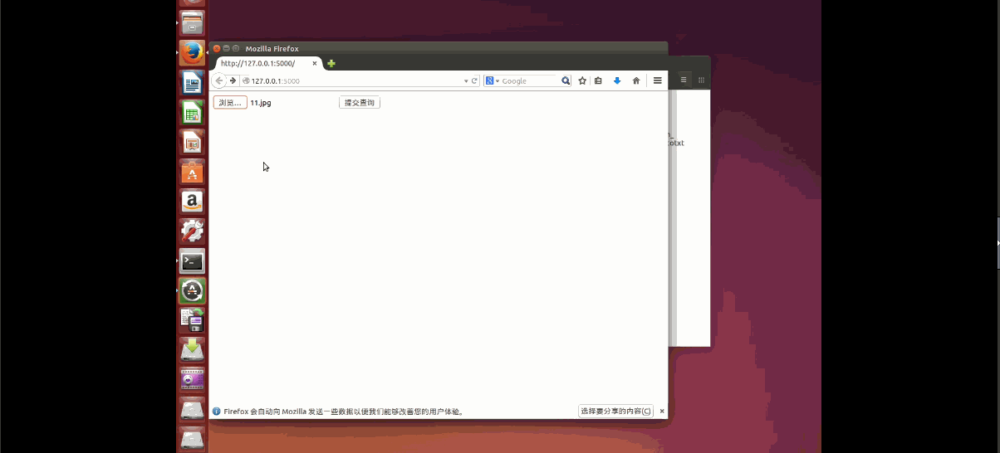

# python-img-convert

基于Flask搭建的web服务器，利用caffe机器深度学习技术，实现图片彩色互转黑白
(核心算法就不放了哈，毕竟是咱家机器学了三年的)

## v1.0.0

### 彩色转黑白


### 黑白转彩色




## 图片转换的执行环境：

  - linux(可选)
  - caffe库
  - Python库(numpy, pyplot, skimage, scipy)
  - NVIDIA GPU驱动(可选。有的话，执行速度快）
  - Flask

## 安装 Caffe

参考了 http://www.linuxidc.com/Linux/2015-07/120449.htm

```
sudo apt-get install build-essential
sudo apt-get install vim cmake git
Sudo apt-get update
sudo apt-get install libprotobuf-dev libleveldb-dev libsnappy-dev libopencv-dev libboost-all-dev
```